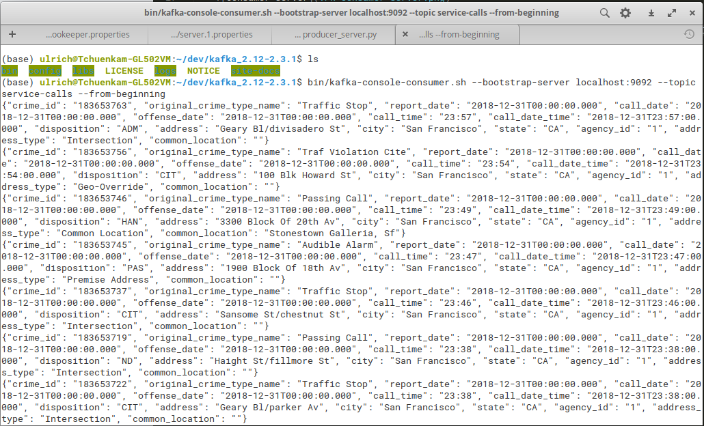
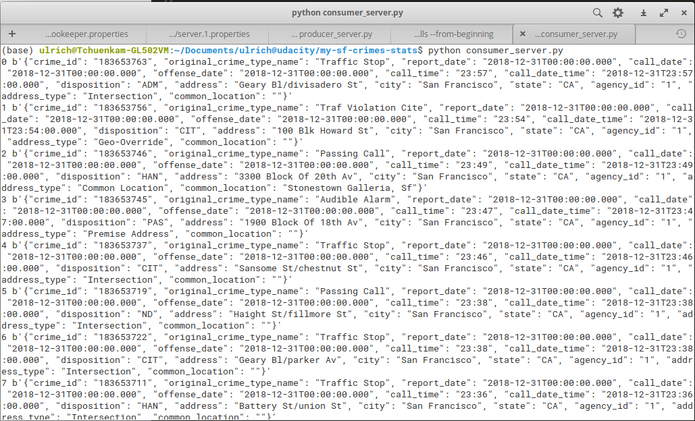
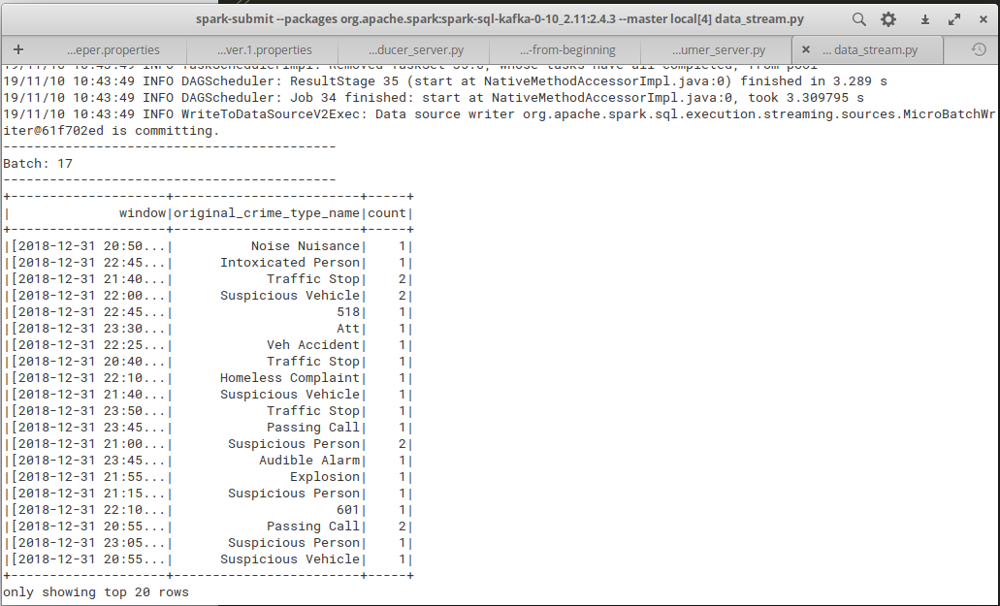

### Steps to run the data stream
**The screenshot following each command represents the output I get after executing the command**

1) `cd` into the kafka folder and execute the following commands to launch **zookeeper** and **kafka** servers:
	* Launch **zookeeper** `bin/zookeeper-server-start.sh config/zookeeper.properties`
	* Launch **kafka server** `bin/kafka-server-start.sh config/server.4.properties`

2) `cd` into the folder containing the **producer** and launch the producer as follows:
	* `python producer_server.py`

3) `cd` into kafka folder and launch the console consumer. The `localhost:port`, and `topic` should tie with what is defined in the producer
	* `bin/kafka-console-consumer.sh --bootstrap-server localhost:9092 --topic service-calls --from-beginning`

	

4) `cd` into the folder containing your **consumer** script and launch the consumer as follows:
	* `python consumer_server.py`

	

5) Launch `spark submit` using the following command. Note that `2.11` and `2.4.3` respectively represents the version of `scala` and `spark` running on my environment. If you have different versions of spark and scala then you should modify the command appropriately. 
	* `spark-submit --packages org.apache.spark:spark-sql-kafka-0-10_2.11:2.4.3 --master local[4] data_stream.py`

	
	
